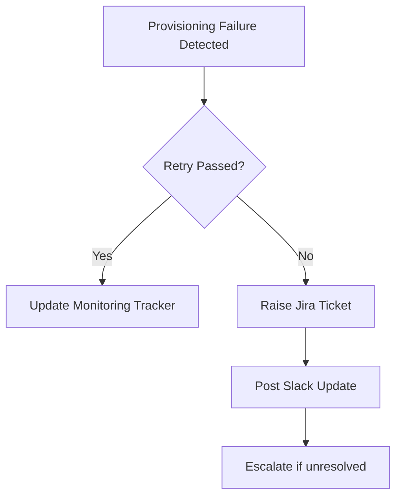

# 🚨 Task 6 — Provisioning Failures

## 🎯 Objective

Validate provisioning failures and determine whether retries succeeded.

---

## ⏰ Schedule

- 11:00 AM
- 3:00 PM

---

## 🔎 Query 6A

```sql
<Query from monitoring sheet>
```

---

## 📋 Required Columns

- Action
- Recipient
- Sources

---

## 🔄 Validation Flow



---

## 🔍 Retry Query

```sql
created:[now-1d TO now]
```

---

## ⚠ Common Errors

<details>
<summary>OneTrust Error Resolution</summary>

### Cause

User has not logged into OneTrust yet.

### Resolution

Ask user to login through JumpCloud.

### Communication

Notify the user through Slack and request confirmation after login.

</details>

---

## 🚨 Escalation Steps

1. Update monitoring tracker
2. Post Slack update
3. Raise Jira if unresolved

---

## 💬 Slack Update Template

```text
Task 6 completed.

Failures identified:
- <application/user>

Jira:
- MYABAUS-XXXX
```

---

## 🎫 Jira Template

```text
Summary:
Task 6 - Provisioning Failure

Description:
Provisioning failure identified during monitoring.

Application/User:
<details>

Retry validation completed.

Issue persists after retry.

Please investigate.
```

---

## ✅ Success Criteria

- Retry validation completed
- Tracker updated
- Jira raised if needed
- Slack communication completed

---

## 🔗 Related SOPs

- Task 11 — Leaver Residuals
- Task 9 — Post-Provisioning Failures
- Emergency Aggregation SOP